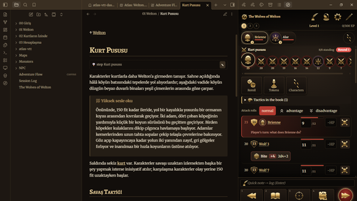

# Torchlight

A dark, gold-trimmed Obsidian theme with a parchment light mode: soot-brown surfaces, gold headings and links,
Merriweather for reading and Alegreya for headings. It was made to sit beside the
[Adventure Runner](https://github.com/thealps01-netizen/adventure-runner) panel, but it is a plain theme and works on
any vault.



- **Dark:** soot and gold leaf.
- **Light:** parchment and bronze ink.
- **Fonts:** embedded (no internet needed), Latin and Latin Extended (Turkish included).
- **Read-aloud boxes:** quote callouts (`> [!quote]`) turn gold.
- **Adventure Runner:** the plugin's panel takes Obsidian's look by default; Torchlight fills the panel's `--dmr-*`
  variables (see the plugin's `docs/theming.md`) to give it the game look: metal medallions and AC shields, gilded
  icons, a red Next button, in dark and in light. It never styles the plugin's classes, only those variables.

Requires Obsidian 1.13.4 or newer: from 1.13.4 callout colours are full CSS colours, which the theme uses.

## Install

Until it is listed in the community themes:

1. Copy `theme.css` and `manifest.json` into `<your vault>/.obsidian/themes/Torchlight/`.
2. Settings → Appearance → Themes → choose **Torchlight**.
3. Settings → Appearance → Base color scheme: **Dark** or **Light**.

To change back: Settings → Appearance → Themes → **Default**.

## Customise

Set any of these on `body` in a CSS snippet (Settings → Appearance → CSS snippets):

```css
body {
  --font-text-theme: var(--font-default);      /* Obsidian's own body font instead of Merriweather */
  --font-interface-theme: var(--font-default); /* … and for the interface */
}
.theme-dark {
  --accent-h: 37; --accent-s: 47%; --accent-l: 60%; /* the accent (gold); a hue/saturation/lightness triple */
}
```

## Development

`src/theme.css` is the source. `npm run build` inlines the fonts and writes `theme.css` (the file Obsidian reads; never
edit it by hand). `npm test` checks the theme against Obsidian's theme guidelines: no `!important`, no remote loading,
embedded fonts with their licences, both colour modes, and that it fills the Adventure Runner panel's variables
(only ones the plugin reads, when the plugin's folder sits next to this one) without styling its classes. Node 20 or
newer, no dependencies.

## License

The theme's code is MIT (see `LICENSE`). The fonts are under the SIL Open Font License 1.1 (see `fonts/FONTS.md`):
[Merriweather](https://github.com/EbenSorkin/Merriweather4) by The Merriweather Project Authors and
[Alegreya](https://github.com/huertatipografica/Alegreya) by Juan Pablo del Peral / Huerta Tipográfica.
